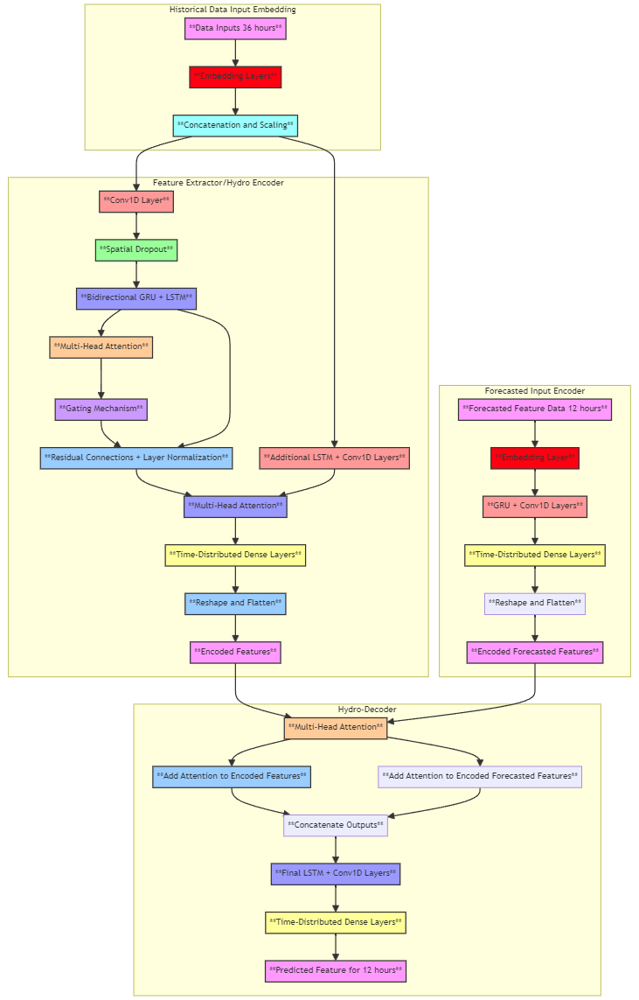
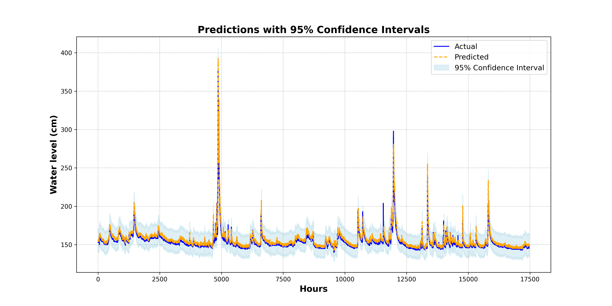
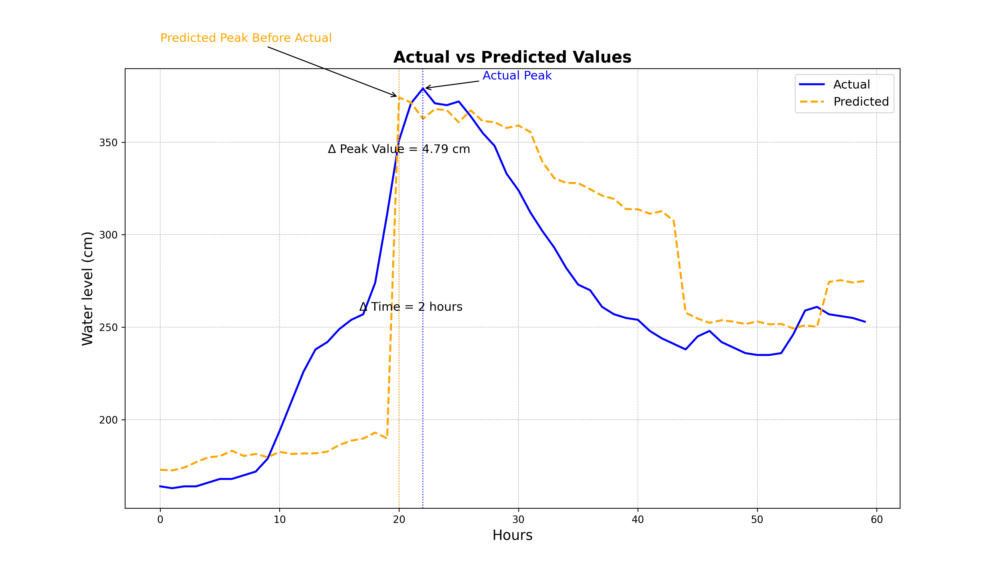
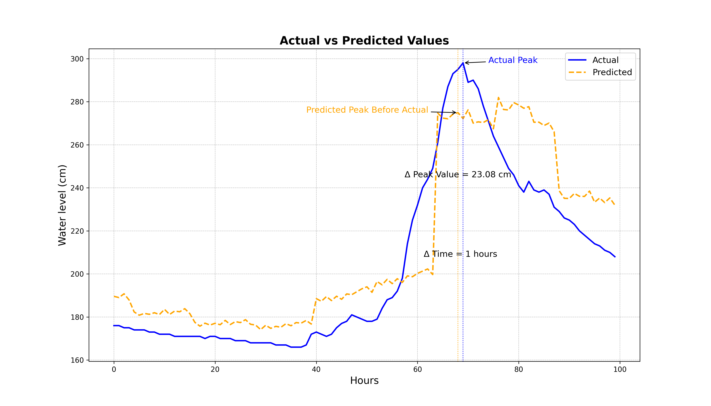

# Hydro-informer

## Overview
This repository contains the data, code, and models for the Hydro-Informer project, a deep learning framework for predicting water levels and flood risks.

## Directory Structure
- `data/`: Contains the datasets used for training and testing.
- `src/`: Contains the source code for data preprocessing, model training, and evaluation.
- `notebooks/`: Contains Jupyter notebooks for exploratory data analysis and model development.
- `models/`: Contains trained model files.
- `docs/`: Contains additional documentation.

### Model
This model leverages Multi-Head Attention mechanisms along with Conv1D and LSTM layers to enhance the predictive performance by focusing on relevant features in the sequence data.



### Predictions with Confidence Intervals
This plot shows the predicted water levels with confidence intervals, indicating the range within which the true water levels are expected to lie.



### Peak Analysis
Comparative analysis of actual vs. predicted water levels for the most significant peaks observed in the testing data.

#### Peak Analysis Case 1


#### Peak Analysis Case 2


#### Peak Analysis Case 3


## Installation
To install the required dependencies, run:
```sh
pip install -r requirements.txt

